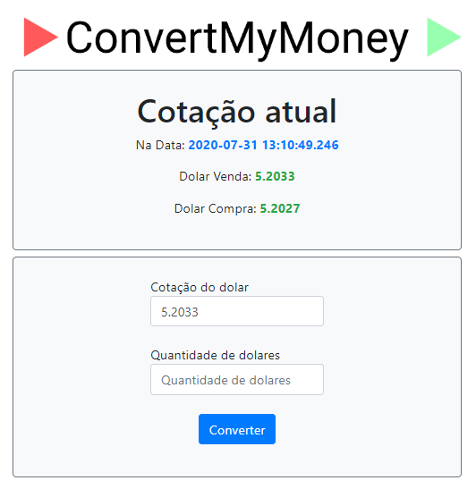

# Convert My Money - From WagDev

<a href="convertmymoney-wagdev.vercel.app"></a>

## Convert My Money

* ConvertMyMoney é uma aplicação para converter quantias de Dolar (USD) em Reais (BRL), utilizando a cotação atual do BCB. Foi desenvolvida em aula no curso Fullstack Master da DevPleno

## Pacotes neste projeto

### Dependências do projeto

* [axios](https://www.npmjs.com/package/axios) v0.19.2
* [bootstrap](https://www.npmjs.com/package/bootstrap) v4.5.0
* [ejs](https://www.npmjs.com/package/ejs) v3.1.3
* [express](https://www.npmjs.com/package/express) v4.17.1
* [jquery](https://www.npmjs.com/package/jquery) v3.5.1
* [moment](https://www.npmjs.com/package/moment) v2.27.0
* [popper](https://www.npmjs.com/package/popper) v1.0.1

### Dependências de desenvolvimento

* [jest](https://www.npmjs.com/package/jest) v26.1.0
* [nodemon](https://www.npmjs.com/package/nodemon) v2.0.4

## Instalar dependências

```shell
$ npm install --save axios
$ npm install --save bootstrap
$ npm install --save ejs
$ npm install --save express
$ npm install --save jquery
$ npm install --save moment
$ npm install --save popper

$ npm install --save-dev jest
$ npm install --save-dev nodemon
```

## Implementar o bootstrap e jQuery no projeto

Para implementar o Boostrap e jQuery no projeto foi necessário importar-los no [index.js](./index.js) e definir o uso deles no app, assim compo referenciá-los no [header.ejs](./views/header.ejs), juntamente com a adicção do [bootstrap.css](./node_modules/bootstrap/dist/css/bootstrap.css).

- *index.js*
````shell
...
const nm_dependencies = ['bootstrap', 'jquery', 'popper.js'];

nm_dependencies.forEach(dep => {
    app.use(`/${dep}`, express.static(path.resolve(`node_modules/${dep}`)));
});
...
````

- *header.js*
````shell
...
<header>
    <!-- somewhere inside head tag -->
    <script src='jquery/dist/jquery.js' charset='utf-8'></script>
    <script src='bootstrap/dist/js/bootstrap.js' charset='utf-8'></script>  
    
    <link rel='stylesheet' href='bootstrap/dist/css/bootstrap.css' />
    <title>Convert My Mondey</title>
    
</header>
...
````

## Algumas imagens


## Author:

* **Wagner Silva (WagDev)**

- LinkedIn: <a href="https://www.linkedin.com/in/wagnerjps/" target="_blank">`linkedin.com/in/wagnerjps`</a>
- Facebook: <a href="https://www.facebook.com/wagnerjps" target="_blank">`facebook.com/wagnerjps`</a>
- Instagram: <a href="instagram.com/wagnerjps" target="_blank">`@wagnerjps`</a>


## Licença

Este projeto é licenciado sobre a licença MIT - veja [LICENSE.md](LICENSE.md) para mais informações.

## Acknowledgments

* Este projeto foi construído durante o curso Fullstack Master do [DevPleno](https://devpleno.com).

## Agradecimentos especiais
Gostaria de agradecer a equipe da [DevPleno](https://devpleno.com) e em especial ao professor [Túlio Faria](https://tuliofaria.dev/) pela decicação e qualidade na sua forma de ensinar. Obrigado!
